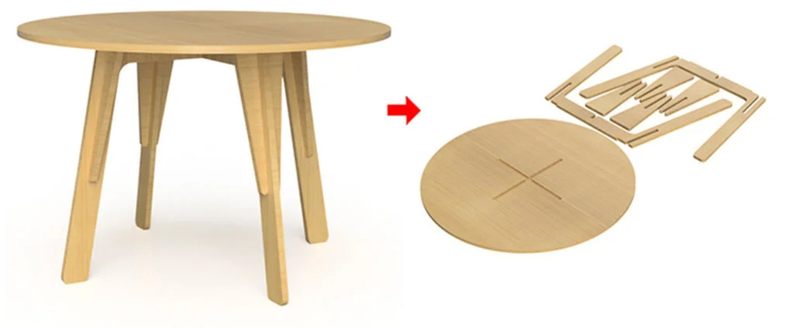
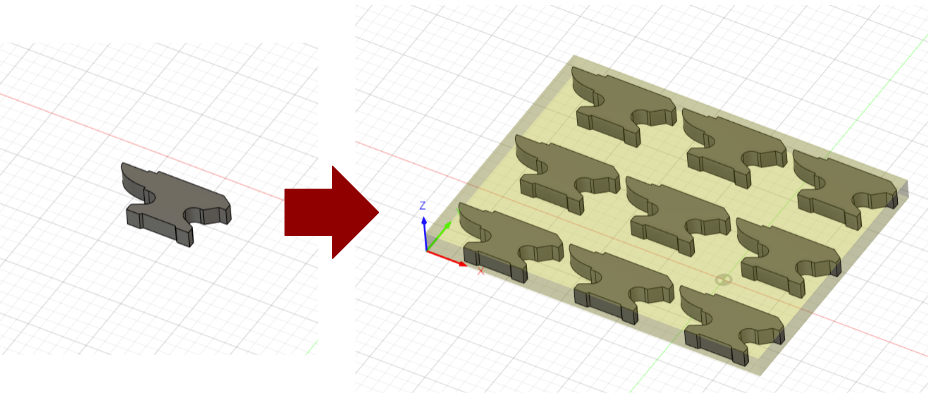

## General Tips
- It's often a good idea to "cut air" prior to cutting the actual material. This is accomplished by intentionally setting the material thickness in your Fusion360 setup to a value 2-3x larger than the actual material thickness. When the operation is run on the CNC, the bit should remain in the air rather than touching the material or spoilboard. By observing the "fake" cut (with the e-stop in hand), you visually verify the toolpaths are what you expect. This method can catch potential tool plunges or unit issue (mm vs inches). 

- Manufacturing models are useful for flat packing a desin without modifying the model (see [Worked Examples](workedExamples#flat-packing-a-design) )

- Manufacturing models can be used to cut multiple identical parts from stock by creating a pattern [(Creating a Rectangular Pattern)](https://help.autodesk.com/view/fusion360/ENU/?guid=SKT-CREATE-RECTANGULAR-PATTERN)

