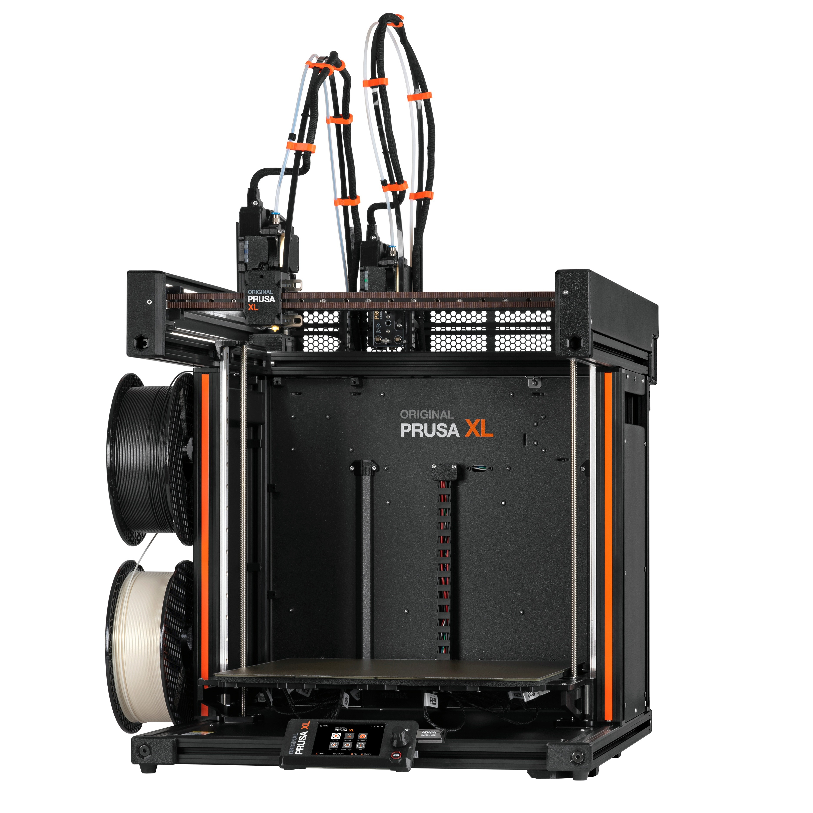

# Prusa XL Dual-Head

## Documentation
[Prusa XL Documentation](https://help.prusa3d.com/tag/xl)

[Assembly Instructions](https://help.prusa3d.com/category/original-prusa-xl-dual-head-assembled_1980)

[Assembly Instructions PDF](../attachments/original-prusa-xl-dual-head-assembled_1980_en_2024-10-05.pdf)

## Procedures
[Firmware Upgrade](https://help.prusa3d.com/article/how-to-update-firmware-mk4-s-mk3-9-s-mk3-5-s-xl_453086)

## Maintenance
[Regular maintenance](https://help.prusa3d.com/article/regular-printer-maintenance-xl_401237)
