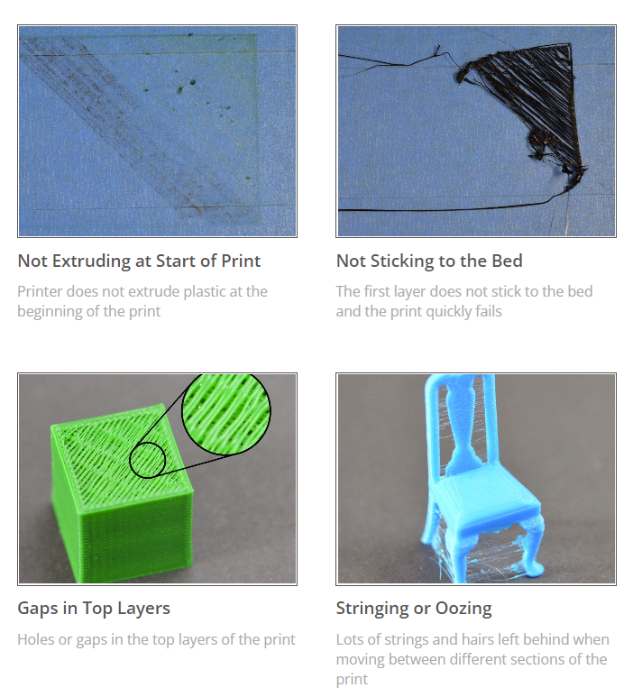
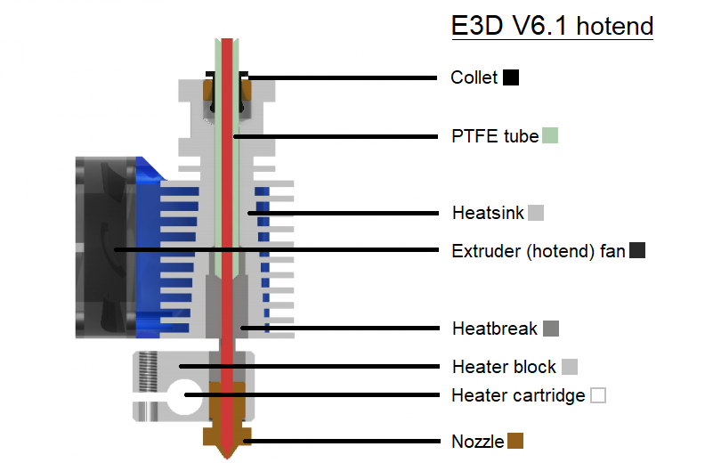

# Maintenance Resources

## Print Quality Troubleshooting Guide

[Print Quality Troubleshooting Guide](https://www.simplify3d.com/resources/print-quality-troubleshooting/)
## Hot End Components

[Anatomy of a Hotend](https://e3d-online.com/blogs/news/anatomy-of-a-hotend)

# Configuration File Repository
- Requires Github account & invite to Prototyping Studio team
- Contains slicer profiles & klipper config files
[Config File Repo](https://github.com/Prototyping-Studio/3dPrinters/tree/main)
